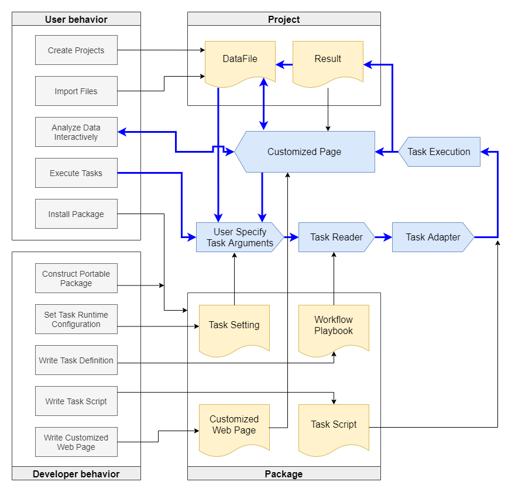

=======================
Terms and Data Entities
=======================

In this section, we explain several terms that used in the Big Data Processor. Each term represents a kind of data entities in the system.
These terms include **Project**, **DataFile**, **Result**, **Package**, **Task**, and **Page**.
These terms are shown in the following figure which is also displayed in the system operation scheme of the previous section, :doc:`the concepts <./concepts>`.
The details and the relationships of these terms are listed below.

Project
=======

A Project is a collection of :ref:`DataFiles <DataFile>` and :ref:`Results <Result>`.
A project is created with a name and an optional description. Several :ref:`Packages <Package>` can also be selected to use in the project.
A project can also be shared among users. Please see the :doc:`Priviledge <./privilege>` for more information.
The Project-related information can be changed after creation.

Under the hood, each Project has a corresponding folder to store all the files or folders which correspond to DataFile records.
Different Projects are organized into separated folders and are consider as independent, although DataFiles can be copied and linked among Projects.

As for the Result, A Result can be seen as a history of a task execution. All the provenance of each task run is recorded in a Result.
A Result records the task execution time, running parameters, input and output files, standard output and standard error messages, and others.
After task execution, the generated output files are new DataFiles that can be used as another task inputs.

DataFile
========
A DataFile record can be generated by importing files or folders.
Executing :ref:`Tasks <Task>` may also generate output files as DataFile records, if the task has defined output files/folders as arguments.
The files and folders of DataFile records are located directly inside the Project folder. For simplicity, we use the in-place folder structure without adding additional nested folders.
The filenames and foldernames are the database ids of their corresponding DataFile records.
For non-folder files, the filename also preserves its extension, and the extension is also stored as the format property of a DataFile record.
The Big Data Processor controls the direct children of the Project folder. Therefore, the system does not aware of file contents inside a folder-typed DataFile.

---------
File Tags
---------

A DataFile record comes with its own tags. These file tags are used to tell whether a DataFile record is valid to be an input argument of a :ref:`Task <Task>`.
File Tags can be used as guards to prevent users to select invalid files or used as filters to narrow down the number of valid DataFile records.
In addition, File Tags are also used to 

Users can also specify their desired tags to distinguish DataFile records.

Result
======

In a Project, a Result can be generated by executing one Task in the selected Packages.

--------
Task Log
--------

Package
=======

Task
====

---------------
Tag Match Rules
---------------

-----------------
Workflow Playbook
-----------------

-------------------
Workflow-typed Task
-------------------

---------------------
Runtime Configuration
---------------------

------------
Task Adapter
------------

Page
====

